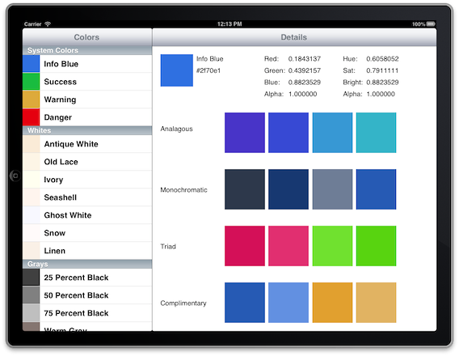

##Blee

###A Color Palette App for iPad

**Blee** is a an iPad app to help generate and select color palettes for your apps.

Based on the work of Ben Gordon found here <https://github.com/bennyguitar/Colours-for-iOS>

####Why?
I was at a hack night and brainstorming a simple project I could put together in a night. I wanted to wrestle with autolayout and I knew I wanted it to be an iPad app.

I recalled coming across Ben Gordon's Colours for iOS project and thought I could use that as a basis for a color utility app.

The idea of generating color palettes is not new but the idea did seem to lend itself to my rather simple goals for the hack night.

####Blee?
I don't even recall why its called Bles so best not to ask. Often naming your new project is one of the hardest early steps. I suspect I just picked it out of thin air in order to move on with the real work. So **Blee** it is

####Installation
Just clone and open the project in Xcode. It was originally developed in Xcode 4 and for iOS 6.1. I have no idea how it works on earlier versions of iOS or Xcode 5. 

####Issues
I'm sure there are lots of less than optimal stuff in here. Such is the nature of one night projects. It works. If you find it useful, great! If you make a change or update I would love to hear about it.

####License
You are free to do whatever you like with this. This project is released under the MIT License as that seems to be the most in the spirit of do as you wish. Enjoy.